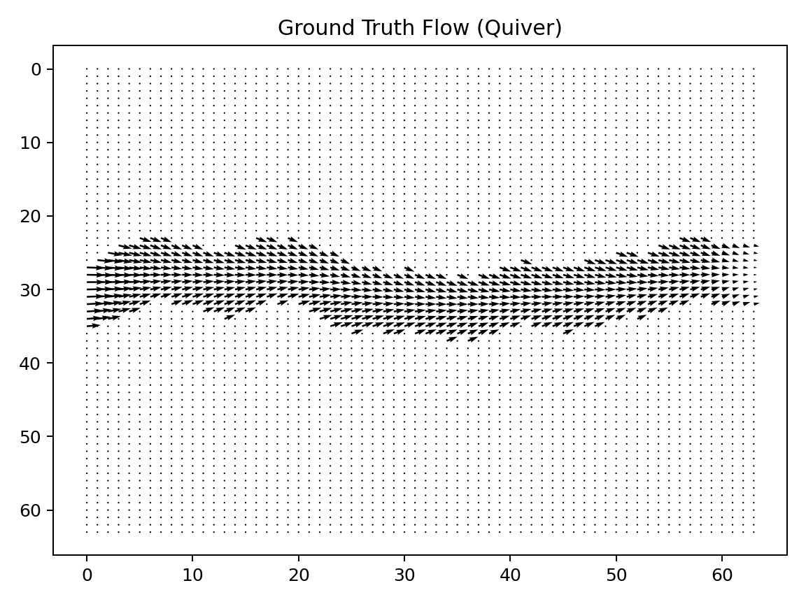
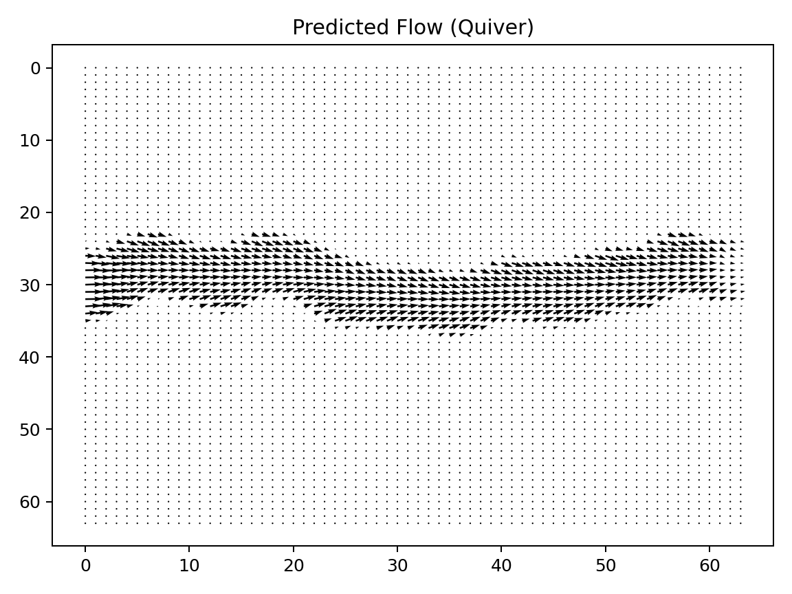

# semi-viscous microfluidic flow model with pytorch

this project builds a small convolutional neural network (cnn) in pytorch to predict microfluidic flow patterns for a slightly viscous fluid. trains a model to predict the flow given the channel shape and inlet.

(only model/training/simulated viz included; no real lab data)

## how it works

1. **model definition (`model.py`)**  
   - defines a small cnn that takes two input channels (**mask + inlet**) and predicts two output channels (**u + v**).  
   - uses pytorch layers to learn patterns in the data.

2. **training (`train.py`)**  
   - loads the generated csv files for training and validation.
   - trains the cnn using mean squared error loss.  
   - prints training and validation loss after each epoch.  
   - saves the trained model.

3. **visualization (`viz.py`)**  
   - loads the trained model.  
   - picks a new sample and shows the channel shape, predicted flow, and true flow for comparison.

## need

- python 3.9+  
- pytorch  
- numpy  
- matplotlib  

## visualized results

**ground truth (quiver)**

**predicted (quiver)**

